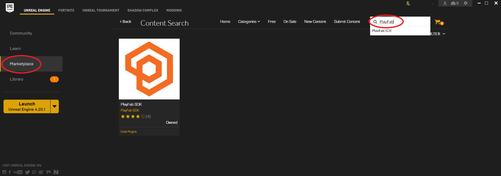

# Unreal 4 Marketplace Plugin for PlayFab README

## 1. Overview:

Unreal Marketplace Plugins for PlayFab

Supported versions will be the root level folders, in the form of version numbers. These numbers update regularly when Unreal releases a new version, and will typically include the latest 3 Unreal versions.

The Unreal Marketplace plugin includes:

* PlayFabSDK Folder: Unreal-Plugin - Put this plugin in your new or existing project to utilize PlayFab
* ExampleProject Folder: Unreal Plugin ExampleProject - Use this project to start your new game, or demo/test the PlayFab system.

This sdk contains a settings option to set developerSecretKey.  For the security of your title, this must be blank for client builds.

## 2. Prerequisites:

* Users should be very familiar with the topics covered in our [getting started guide](https://api.playfab.com/docs/general-getting-started).

To connect to the PlayFab service, your machine must be running TLS v1.2 or better.
* For Windows, this means Windows 7 and above
* [Official Microsoft Documentation](https://msdn.microsoft.com/en-us/library/windows/desktop/aa380516%28v=vs.85%29.aspx)
* [Support for SSL/TLS protocols on Windows](http://blogs.msdn.com/b/kaushal/archive/2011/10/02/support-for-ssl-tls-protocols-on-windows.aspx)


## 3. Installation:

The following instructions apply the SDKs in the plugin provided.

Assumptions

* Windows operating system
* [Microsoft Visual Studio](https://www.visualstudio.com/en-us/products/visual-studio-community-vs.aspx) already installed
* [Unreal Engine](https://www.unrealengine.com/dashboard) already installed

A new project can be built directly from the example project included with the plugin:

* Extract the Unreal Plugin package to {UnrealPackageLocation}
* Navigate to {UnrealPackageLocation}/ExampleProject
* Right click on ExampleProject.uproject, and "Generate Visual Studio project files" - This process may take several minutes
* Once finished, open {UnrealPackageLocation}/ExampleProject/ExampleProject.sln in Visual Studio
* In Visual Studio, "Rebuild Solution" - This process may take several minutes
* You should now be able to utilize the PlayFab APIs

To use the plugin as a project plugin in Existing Projects:
* Extract the Unreal SDK package to {UnrealPackageLocation}
* Navigate to {UnrealPackageLocation}/PlayFabPlugin
* Copy the PlayFab folder into the "Plugins" directory in your existing Unreal project (If the "Plugins" folder does not exist, create it)
* Right click on YourProject.uproject, and "Generate Visual Studio project files" - This process may take several minutes
* Once finished, open your *.sln project file with Visual Studio
* Open the YourProject.Build.cs file and update the PublicDependencyModuleNames with "PlayFab" (for the Blueprints module) and "PlayFabCpp" (for the C++ module)
* In Visual Studio, "Rebuild Solution" - This process may take several minutes
* You should now be able to utilize the PlayFab APIs

To use the  plugin as an engine plugin in Existing Projects:
* In the Epic Games launcher, go to the  and search for the PlayFab SDK
* Click on the PlayFab SDK and click "Install to Engine"
* If you were previously using the plugin as a project plugin, delete the PlayFab folder under "Plugins" directory in your existing Unreal project.
* Update the YourProject.uproject file with the Plugin section as follows :
```
"Modules": [
    {
      "Name": "YourProject",
      "Type": "Runtime",
      "LoadingPhase": "Default",
      "AdditionalDependencies": [
        "Engine"
      ]
    }
],
"Plugins": [    // <---
    {
      "Name": "PlayFab",
      "Enabled": true,
      "MarketplaceURL": "com.epicgames.launcher://ue/marketplace/content/217fdf581b784571af03d3fb6580368f"
    }
]
```
* Right click on YourProject.uproject, and "Generate Visual Studio project files" - This process may take several minutes
* Once finished, open your *.sln project file with Visual Studio
* Open the YourProject.Build.cs file and update the PublicDependencyModuleNames with "PlayFab" (for the Blueprints module) and "PlayFabCpp" (for the C++ module)
* In Visual Studio, "Rebuild Solution" - This process may take several minutes
* You should now be able to utilize the PlayFab APIs

Once the plugin is properly installed, run the Unreal Engine environment editor.
Navigate to the dropdown menus:  Edit -> Project Settings
On the left menu, scroll to the bottom, find Plugins -> PlayFab
Fill in the TitleId with the appropriate value from your project, found in the PlayFab [Game Manager](https://developer.playfab.com/en-us/studios)
If this is a server process, you can also fill in the developerSecretKey.  For the security of your title, this must be blank for client builds.

## 4. Troubleshooting:

If you experience this error:
Plugin 'PlayFab' failed to load because module 'PlayFab' could not be found.  Please ensure the plugin is properly installed, otherwise consider disabling the plugin for this project.

Your Unreal project is not set up to be a C++ project.  Here is a tutorial that will help fix this problem.
http://idkudk.blogspot.com/2015/02/how-to-get-plugins-to-package-correctly.html

General troubleshooting:

For a complete list of available APIs, check out the [online documentation](http://api.playfab.com/Documentation/).

## 4.b Known Issue:

In Unreal 4.25, there is a step that is highly recommended:

### Fix it in the Unreal Editor GUI:

* Open Unreal Editor for your project
* Edit -> Project Settings ... -> Engine -> Network
* At the top of the Network section is the checkbox "Verify Peer".
* Toggle it off.
* Save All. (ctrl + shift +s)
* Toggle it on.
* Save All. (ctrl + shift +s)


### Fix it in the files:

* {Project}/Config/DefaultEngine.ini
* Add/Replace these lines:
    * [/Script/Engine.NetworkSettings]
    * n.VerifyPeer=True

## 5 Limitations

This sdk is meant for use with a network connection. It relies heavily on HttpModule which is known in Unreal Engine to not be threadsafe. https://udn.unrealengine.com/questions/526017/view.html "HTTP requests are only supported to be created/destroyed on the main thread."

If you want to step around this Unreal Engine limitation, you may clone Epic's Unreal Engine source code and enable FORCE_THREADSAFE_SHAREDPTRS in SharedPointerInternals.h https://udn.unrealengine.com/questions/252125/view.html and load your project with that built version of Unreal.


#### Contact Us
We love to hear from our developer community!
Do you have ideas on how we can make our products and services better?

Our Developer Success Team can assist with answering any questions as well as process any feedback you have about PlayFab services.

[Forums, Support and Knowledge Base](https://community.playfab.com/index.html)


## 5. Acknowledgements

The PlayFab Unreal C++ SDK was built by [Phoenix Labs](http://www.phoenixlabs.ca/), and submitted to PlayFab November, 2015

On September 2017, Montana Tuska rebuilt this plugin, adding support for 4.17 and other major improvements, on September, 2017.

The initial draft of PlayFab UnrealBlueprintSDK and the Blueprint Tutorial in this document were built by Joshua Lyons, and submitted to PlayFab October, 2015

Montana Tuska also makes and supports another plugin which combines the Unreal OnlineSubsystem, and the PlayFab API. You can see it on his [GitLab repo](https://gitlab.com/mtuska/OnlineSubsystemPlayFab)

This plugin is based off of the above mentioned plugins.

## 6. Copyright and Licensing Information:

  Apache License --
  Version 2.0, January 2004
  http://www.apache.org/licenses/

  Full details available within the LICENSE file.
